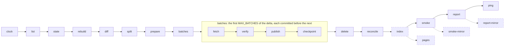

# ctan

[](https://github.com/katoptra/ctan/actions/workflows/sync.yml)
[](LICENSE)
[](https://github.com/katoptra/ctan/actions/workflows/sync.yml)

An hourly mirror of all of [CTAN](https://ctan.org) on Cloudflare R2, served at
`https://ctan.katoptra.org/` with every CTAN path at the root. About 511,000 files and
140 GB, synced from CTAN's master by a list diff: each hour lists upstream, compares it
with what the bucket already holds, and moves only the difference. It costs about $2 a
month, all of it storage, and runs entirely on GitHub Actions.

## How to use

TeX Live and TinyTeX both use `tlmgr`:

```sh
tlmgr option repository https://ctan.katoptra.org/systems/texlive/tlnet/
tlmgr update --self --all
```

For a fresh install, give the installer the same URL:

```sh
install-tl -repository https://ctan.katoptra.org/systems/texlive/tlnet/
```

Any directory URL lists what the mirror holds there:
`https://ctan.katoptra.org/systems/knuth/`. The root serves CTAN's own index page.

To go back to CTAN's mirror rotation: `tlmgr option repository ctan`.

Is it fresh? `curl -s https://ctan.katoptra.org/timestamp` prints the hour of the last
completed run, the same file CTAN's mirror monitor reads.

## How it works

Once an hour a GitHub Actions job runs this pipeline inside the toolbox image from
[katoptra/lib](https://github.com/katoptra/lib). Every solid box is a verb of lib's rsync
engine; the dashed ones are this mirror's own.



What this mirror owns, in [`Taskfile.yml`](Taskfile.yml):

- **Its identity**, in root vars: `SOURCE` (CTAN's master, `rsync.dante.ctan.org`),
  `HOST`, `BUCKET`, the signed TeX Live subtree `TL` and its key fingerprint `TL_KEY`, a
  200 GB `CEILING_GB` past which a run refuses to start, and a `LIST_FLOOR` under which
  a listing is taken as truncated rather than as a deletion list.
- **Directory pages.** R2 serves no listings, so `pages` draws one for every directory the
  run touched, from the state file rather than from upstream, and `index` uploads each
  under two keys: `<dir>/ctan.katoptra.org.directory.index.html`, which a zone rule
  serves for `/dir/`, and the bare `<dir>`, which serves `/dir` where other mirrors would
  redirect. `docs/reference.md` section 7 has why there are two.
- **Read-back checks.** After the engine's sample, `smoke-mirror` reads one redrawn page
  back under both keys, compares one HTML file byte for byte with the bucket's copy (the
  canary for Cloudflare's HTML rewriters), and asks for `/timestamp` as a Perl client.
- **Its row of the run summary**, and an `offline` check over `fixtures/`.

Everything else, from the list diff and the batching to the signature checks, the state
file and the daily reconcile, is the engine's and is documented once in
[lib's README](https://github.com/katoptra/lib#the-rsync-engine).

## Want your own?

### 1. Fork it

Fork [katoptra/ctan](https://github.com/katoptra/ctan). Two lines of `Taskfile.yml` are
yours to change: `HOST`, your domain, and `BUCKET`, your bucket's name. `SOURCE` stays:
CTAN asks that a mirror pull from its master.

### 2. Storage

The bucket is the mirror. Every CTAN path sits at its root, under CTAN's own name, plus
one reserved prefix, `.state/`, for the listing the last run left behind. Storage is the
whole bill: 140 GB at R2's $0.015 per GB-month, under $2.

| What | Why |
|---|---|
| An R2 bucket, or any S3-compatible bucket | Objects and their state |
| An API token with Object Read & Write, scoped to that bucket | The three `AWS_*` values in step 3 |
| A custom domain on the bucket, which is `HOST` | What clients and the read-back checks fetch from |

`aws.config` keeps every upload under 4 GiB a single PutObject and sends the five larger
CTAN files in 512 MiB parts. How the engine uses a bucket, what `.state/` holds and why
the state is only a cache of the bucket: [lib, Storage](https://github.com/katoptra/lib#storage).

### 3. Secrets

Four values, in one vault item named `ctan`:

| Section | Field | What it is | Reaches the run as |
|---|---|---|---|
| `r2` | `access_key_id` | The token from step 2 | `AWS_ACCESS_KEY_ID` |
| `r2` | `secret_access_key` | Its secret | `AWS_SECRET_ACCESS_KEY` |
| `r2` | `endpoint` | `https://<account-id>.r2.cloudflarestorage.com` | `AWS_ENDPOINT_URL` |
| `healthcheck` | `url` | Optional: a healthchecks.io ping URL | `HEALTHCHECK_URL` |

Put your vault's UUID into the four references in [`op.env`](op.env), make a service
account that can read that vault, and store its token as the `OP_SERVICE_ACCOUNT_TOKEN`
secret, on the organization or on the repository. That is the whole requirement; nothing
else is configured on GitHub. Finding a vault's UUID, why a UUID and not a name, and the
repository-secrets alternative: [lib, Secrets](https://github.com/katoptra/lib#secrets).

### 4. The zone

Four Cloudflare rules, set by hand once and never touched by the pipeline, all scoped to
the mirror's hostname. `docs/reference.md` section 6 has each rule's expression and the
measurement behind it.

| Rule | What it does |
|---|---|
| Configuration Rule | Turns off Email Obfuscation, Rocket Loader, Automatic HTTPS Rewrites and Browser Integrity Check. The first three rewrite HTML in flight; a mirror that alters bytes is not a mirror. The fourth refuses Perl and Python clients that every other CTAN mirror serves. |
| Cache Rule | Bypass. Caching saves nothing under 10M requests a month and would leave `/timestamp` stale. |
| Transform Rule | `/` serves CTAN's `index.html` |
| Transform Rule | `/dir/` serves that directory's page |

### 5. Prove it, run it, schedule it

On a laptop with go-task, the 1Password CLI and Docker or Apple `container`:

```sh
task check                # render every command of the pipeline inside the image; diff against render.txt
task run -- task offline  # the read-back checks and the directory pages, over a canned hour; no network
task plan                 # the read-only half against your bucket: list, state, diff, split; nothing uploaded
```

Then Actions, sync, Run workflow. The first run finds an empty bucket, takes the whole
tree as the delta and works it four batches at a time, queueing the next run itself until
nothing is left: about 140 GB from CTAN over several chained runs. Pause the healthcheck
first. Every run after that moves the hour's delta, usually a few dozen files.

Nothing in this repository schedules a run. Add a `schedule:` trigger to
`.github/workflows/sync.yml` with a minute of your own, or dispatch it from outside as
this mirror is. CTAN asks for once an hour at a fixed minute.

## Operating it

`task` alone prints the menu. A run takes its flags after the double dash, and the same
flags go in the workflow's `vars` input:

```sh
task sync                                   # one run, the same thing Actions runs
task sync -- MAX_BATCHES=8                  # more of a backlog in one run
task sync -- RECONCILE=true                 # rebuild the state from the bucket and sweep orphans now
gh workflow run sync.yml -f vars='RECONCILE=true'
```

Every run appends one table to its job page: when it started and how long it took, the
delta and what landed, the state, storage, the signature check, and this mirror's row of
directory pages redrawn. A failed run is the only alert: healthchecks.io emails when the
hour passes without a ping.

Failed runs, first fills, rebuilding the state, deleting a key, redrawing every page,
rotating the token, a dispatcher that stopped: [`docs/reference.md`](docs/reference.md)
section 5, the runbook.

## Reference

[`docs/reference.md`](docs/reference.md) holds the numbers behind the mirror, each with
the date it was verified:

1. **Baseline**: the measured tree, its churn, its busiest hours
2. **Limits**: R2, the Cloudflare zone, Actions, CTAN's master, the tools
3. **Cost**: the bill line by line, and what traffic at any share of CTAN would cost
4. **Monitoring**: the healthcheck and its settings
5. **Runbook**
6. **Zone configuration**: every rule with its expression
7. **Why directory pages**: listings drawn under two keys

Pull requests are welcome.

MIT licensed. Built by [Josh Vaughen](https://ijosh.com).
