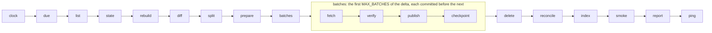

<p align="center">
  <a href="https://github.com/katoptra">
    <picture>
      <source media="(prefers-color-scheme: dark)" srcset="https://katoptra.org/brand/katoptra-mark-dark-224.png">
      
    </picture>
  </a>
</p>

<h1 align="center">ctan</h1>

<p align="center">An hourly mirror of all of CTAN on Cloudflare R2.</p>

<p align="center">
  <a href="https://github.com/katoptra/ctan/actions/workflows/sync.yml"></a>
  <a href="LICENSE"></a>
  <a href="https://github.com/katoptra/ctan/actions/workflows/sync.yml"></a>
</p>

This repository is an hourly mirror of all of [CTAN](https://ctan.org) on Cloudflare R2. The
mirror serves each CTAN path at the root of `https://ctan.katoptra.org/`. It holds
approximately 514,000 files and 140 GB. A list diff copies them from the master of CTAN.
Each hour, a run gets the listing of upstream and compares it with the files in the bucket.
Then the run moves only the difference.

The cost is approximately $2.10 a month, and all of it is for storage. The runs are GitHub
Actions jobs, and an external scheduler starts them.

## How to use

TeX Live and TinyTeX use `tlmgr`. To use this mirror, set it as the repository of `tlmgr`.
Then update:

```sh
tlmgr option repository https://ctan.katoptra.org/systems/texlive/tlnet/
tlmgr update --self --all
```

For a new installation, give the same URL to the installer:

```sh
install-tl -repository https://ctan.katoptra.org/systems/texlive/tlnet/
```

A directory URL shows the files that the mirror holds in that directory, for example
`https://ctan.katoptra.org/systems/knuth/`. The root serves the index page of CTAN.

To use the mirror rotation of CTAN again, run `tlmgr option repository ctan`.

Is it fresh? The master of CTAN writes its clock to `timestamp` each hour. The mirror copies
`timestamp` the same as each other file, and the mirror monitor of CTAN reads it:

```sh
curl -s https://ctan.katoptra.org/timestamp
```

## How it works

Each hour, a GitHub Actions job runs this pipeline in the toolbox image from
[katoptra/lib](https://github.com/katoptra/lib). Each box is a verb of the toolbox or of the
rsync engine in lib. This mirror adds no verbs.


```mermaid
flowchart LR
  clock --> due --> list --> state --> rebuild --> diff --> split --> prepare --> batches
  subgraph b["batches: the first MAX_BATCHES of the delta, each committed before the next"]
    direction LR
    fetch --> verify --> publish --> checkpoint
  end
  batches --> b --> delete --> reconcile --> index --> smoke --> report --> ping
```

This mirror sets these root vars in [`Taskfile.yml`](Taskfile.yml):

- **`SOURCE`** is the master of CTAN, `rsync.dante.ctan.org`. **`HOST`** and **`BUCKET`** are
  the domain and the bucket of the mirror.
- **`TL`** is the signed TeX Live subtree, `systems/texlive/tlnet`. **`TL_KEY`** is the
  fingerprint of the TeX Live primary key. The engine examines the SHA-512 checksum and the
  GPG signature of `texlive.tlpdb`, and of each installer and updater at the root of `TL`,
  `update-tlmgr-latest` too.
  On CTAN, only these files have a signature that the mirror can pin. The mirror copies all
  other files on CTAN byte for byte, tlcontrib and the TeX Live ISO images too.
- **`CEILING_GB`** is 200. If upstream is more than 200 GB, a run does not start.
- **`LIST_FLOOR`** is 460,000, approximately 90% of a listing of CTAN. A listing with fewer
  lines stops the run, because a truncated listing must not become a list of deletions.
- **`INDEX`** is `ctan.katoptra.org.directory.index.html`. With it, the engine makes a page
  for each directory, at two keys: `<dir>/ctan.katoptra.org.directory.index.html` for
  `/dir/`, and `<dir>` for `/dir`. **`PAGE_FOOT`** puts a link to the same directory on
  ctan.org at the end of each page. `docs/reference.md` section 7 tells why there are two
  keys.
- **`CANARY`** is `biblio/bibtex/contrib/german/dinat/dinat-index.html`. This HTML file has
  plain `http://` links and `mailto:` addresses, which the HTML rewriters of the zone change.
  The canary also finds a zone that rejects a Perl client.
- **`FRESH_KEY`** is `timestamp`, in which the master writes its clock each hour.
  **`FRESH_HOURS`** is 6. The mirror is hourly. Thus, if the clock does not change for six
  hours, the master stopped, or the copy in the mirror stopped. Then the run stops with an
  error.

The engine does all other work:

- The list diff
- The batches
- The signature checks
- The state file
- The daily reconcile.

[lib, The rsync engine](https://github.com/katoptra/lib#the-rsync-engine) tells how the engine
does this work, and how it uses the vars in this section.

## Want your own?

### 1. Fork it

Fork [katoptra/ctan](https://github.com/katoptra/ctan). In `Taskfile.yml`, change these two
lines:

- `HOST`: set it to your domain.
- `BUCKET`: set it to the name of your bucket.

Do not change `SOURCE`. CTAN tells each mirror to get its files from the master.

### 2. Storage

The bucket is the mirror. Each CTAN path is at the root of the bucket, with its name on
CTAN. The bucket also has one reserved prefix, `.state/`, for the listing that the last run
put there. Storage is the full cost. On R2, the storage cost of approximately 140 GB is
approximately $2.10 a month, at $0.015 for each GB-month.

| What | Why |
|---|---|
| An R2 bucket, or a different S3-compatible bucket | The objects and their state |
| An API token with Object Read & Write, for that bucket only | The three `AWS_*` values in step 3 |
| A custom domain on the bucket, which is `HOST` | The clients and the read-back checks fetch from it |

The rsync image of lib has an `aws.config` at `/etc/aws.config`. It sends each file smaller
than 4 GiB as one PutObject. It sends the five larger CTAN files in parts of 512 MiB.
[lib, Storage](https://github.com/katoptra/lib#storage) tells how the engine uses a bucket and
what `.state/` holds. It also tells why the state is only a cache of the bucket.

### 3. Secrets

Put four values in one vault item, with the name `ctan`:

| Section | Field | What it is | Variable in the run |
|---|---|---|---|
| `r2` | `access_key_id` | The token from step 2 | `AWS_ACCESS_KEY_ID` |
| `r2` | `secret_access_key` | Its secret | `AWS_SECRET_ACCESS_KEY` |
| `r2` | `endpoint` | `https://<account-id>.r2.cloudflarestorage.com` | `AWS_ENDPOINT_URL` |
| `healthcheck` | `url` | Optional: a healthchecks.io ping URL | `HEALTHCHECK_URL` |

Then do these steps:

1. Put the UUID of your vault in the four references in [`op.env`](op.env).
2. Make a service account that can read that vault.
3. Store its token as the `OP_SERVICE_ACCOUNT_TOKEN` secret, on the organization or on the
   repository.

No other configuration on GitHub is necessary.
[lib, Secrets](https://github.com/katoptra/lib#secrets) tells you:

- How to find the UUID of a vault
- Why the references use a UUID and not a name
- How to use repository secrets as an alternative.

### 4. The zone

The zone has four Cloudflare rules. Each rule is applicable only to the hostname of the
mirror. The rules are not part of the pipeline: you set them one time, and the pipeline does
not change them. `docs/reference.md` section 6 gives the expression of each rule and the
measurement for it.

| Rule | What it does |
|---|---|
| Configuration Rule | It sets Email Obfuscation, Rocket Loader, Automatic HTTPS Rewrites and Browser Integrity Check to off. The first three change the HTML while it goes to the client. The fourth sends a 403 to Perl and Python clients. If one of the four operates again, the canary stops the run. |
| Cache Rule | Bypass. With less than 10M requests a month, a cache does not decrease the cost. A cache also serves a previous copy of `/timestamp`. |
| Transform Rule | `/` serves the `index.html` of CTAN. |
| Transform Rule | `/dir/` serves the page of that directory. |

### 5. Do the checks, run it, schedule it

On a laptop with go-task, the 1Password CLI and Docker or Apple `container`, do the check:

```sh
task check                # render every command of the pipeline inside the image; diff against render.txt
```

Then start the workflow on GitHub: Actions, sync, Run workflow.

The first run finds an empty bucket. Thus, the delta is the full tree. Each run does four
batches of the delta and then starts the next run. This continues until all batches are
done. The first fill copies approximately 140 GB from CTAN, in a chain of runs. After the
first fill, each run moves the delta of one hour, usually a few dozen files.

Pause the healthcheck before the first run. The first fill continues for more hours than the
grace.

Nothing in this repository starts a run on a schedule. To start runs, do one of these steps:

- Add a `schedule:` trigger to `.github/workflows/sync.yml`, with a minute that you select.
- Dispatch the workflow from an external scheduler, the same as this mirror.

CTAN tells each mirror to get the changes one time each hour, at a fixed minute.

## Operating it

`task` with no task name prints the menu. Give the flags of a run after the double dash
(`--`). The `vars` input of the workflow accepts the same flags:

```sh
task sync                                   # one run, the same thing Actions runs
task sync -- MAX_BATCHES=8                  # more of a backlog in one run
task sync -- RECONCILE=true                 # rebuild the state from the bucket and sweep orphans now
gh workflow run sync.yml                    # one run in Actions
gh workflow run sync.yml -f vars='RECONCILE=true'
```

Each run adds one table to its job page. The table shows these items:

- When the run started, and the time that it used
- The delta, and the files that the run uploaded
- The state and the storage
- The signature check
- The directory pages that the run made again
- The clock in `timestamp`, and its limit of 6 h.

A missing ping is the only alert. If a slot gets no ping, healthchecks.io sends an email when
the grace ends. The entries that follow are for two conditions:

- **The time in `timestamp` did not change for six hours.** This shows that dante does not
  update. Examine mirmon and dante. No change in this repository is necessary. For the other
  engine verbs that can stop a run, refer to
  [lib, When a run fails](https://github.com/katoptra/lib#when-a-run-fails).
- **The run did not start.** Nothing in this repository starts a run. Examine the scheduler
  ([katoptra/dispatch](https://github.com/katoptra/dispatch#when-something-goes-wrong)). Then
  use `gh workflow list --all` to find a manual stop: the state is `disabled_manually`. Until
  the scheduler operates again, start runs with `gh workflow run sync.yml`.

[`docs/reference.md`](docs/reference.md) section 5 is the runbook of this mirror. It has an
entry for each of these conditions:

- A run that stopped with an error
- The first fill
- A state file that is not correct
- A key to delete
- Directory pages to make again
- A secret to change
- A scheduler that stopped.

## Reference

[`docs/reference.md`](docs/reference.md) holds the numbers of the mirror. Each number has the
date of its check:

1. **Baseline**: the measured tree, the files that change each month, and the hours with the
   most changes
2. **Limits**: R2, the Cloudflare zone, Actions, the master of CTAN, the tools
3. **Cost**: the cost of each item, and the cost of the traffic for a part of CTAN
4. **Monitoring**: the healthcheck and its configuration
5. **Runbook**
6. **Zone configuration**: each rule and its expression
7. **Why directory pages**: listings at two keys.

Pull requests are welcome.

MIT licensed. Built by [Josh Vaughen](https://ijosh.com).
